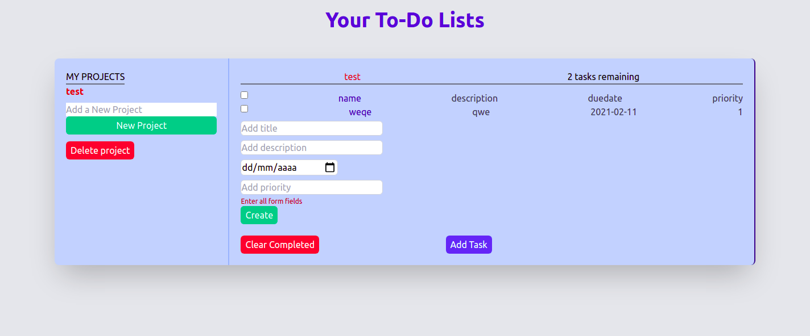

# JavaScript To-Do List

> With this project, new to-do's can be added with fields for title, description, due-date, and priority and each to-do can be checked once completed. All to-dos belong to given projects. With simple styles, the projects and to-dos are displayed.

> All projects and to-dos are stored in the browser's local storage.

## Built

- Javascript
- HTML 5
- TailwindCSS

## Live Demo

[Live Demo](https://mke2111.github.io/to-do-list/ )

## Getting Started

To get a local copy up and running follow these simple example steps.

### Prerequisites

- A browser
- Text Editor

### Setup

**STEP 1**
In the terminal, Run the following commands.

- `git clone https://github.com/mke2111/to-do-list.git`
- `cd to-do-list`

OR

- Download the zip file form `https://github.com/mke2111/to-do-list/tree/development`

**STEP 2**

- Run `npm install` to download all dependencies for the To-do list project.

**STEP 3**

-Run `npx webpack --watch` to compile all the Js code.

**STEP 4**

- Then open the `index.html` file using a browser.
- Enjoy the simple To-do List.

## Authors

### Author 1

👤 **Roy Mukuye**

- GitHub: [@mke2111](https://github.com/mke2111)
- Twitter: [@Roymkenya](https://twitter.com/Roymkenya)
- LinkedIn: [Roy Mukuye](https://www.linkedin.com/in/roy-mukuye-42b07b1b4)

### Author 2

👤 **Giordano Diaz**

- Github: [@diazgio](https://github.com/diazgio)
- Twitter: [@giordano_diaz](https://twitter.com/giordano_diaz)
- LinkenIn:[giordano-diaz](www.linkedin.com/in/Giordano-Diaz) 

## 🤝 Contributing

Contributions, issues and feature requests are welcome!

Feel free to check the [issues page](https://github.com/mke2111/to-do-list/issues).

## Show your support

Give a ⭐️ if you like this project!

## 📝 License

This project is [MIT](https://opensource.org/licenses/MIT) licensed.
